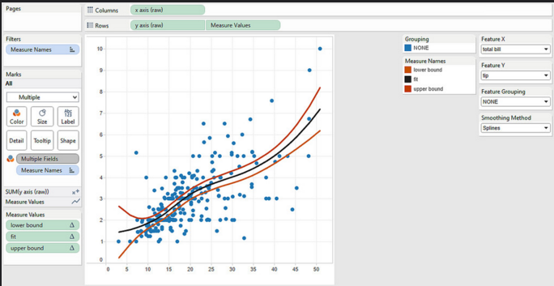

#  Plotting Lab

## Introduction
At the beginning of the week, you were given an overview of Project 1. 

#### Requirements

- Acquire the data
    - Describe your data 
- Parse the data
    - Perform exploratory analysis methods with visualization and statistical analysis 
- Mine the data
    - Use plotting libraries to create visualizations
- Refine the data
    - Use NumPy to apply basic summary statistics: mean, median, mode
    - Determine if dataset follows normal distribution 
- Present the results
    - Answer 25 questions about a dataset in a Jupyter notebook that is hosted on GitHub

**Bonus:**
- Use seaborn and/or plotly to do EDA on Project 1

#### Deliverable

Here's a link to a description on [how to conduct EDA with Tableau](http://www.r-bloggers.com/scatter-plots-with-marginal-densities-an-example-for-doing-exploratory-data-analysis-with-tableau-and-r/) & some screenshots of what we expect:

