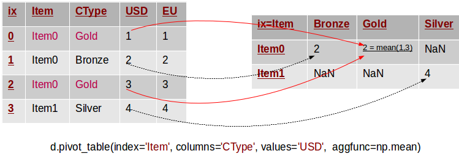

#  Intro to Pandas 3
Week 2 | Lesson 3.1

### LEARNING OBJECTIVES
*After this lesson, you will be able to:*
- Demonstrate how to use pandas.pivot_table
- Demonstrate how to use the parameters: values, columns, index, aggfunc, and margins

### INSTRUCTOR PREP
*Before this lesson, instructors will need to:*
- Read in / Review any dataset(s) & starter/solution code
- Generate a brief slide deck

### LESSON GUIDE
| TIMING  | TYPE  | TOPIC  |
|:-:|---|---|
| 10 min  | [Introduction](#introduction)   | pandas.pivot_table  |
| 10 min  | [Demo / Guided Practice](#demo)  | values  |
| 10 min  | [Demo / Guided Practice](#demo)  | columns  |
| 10 min  | [Demo / Guided Practice](#demo)  | index  |
| 10 min  | [Demo / Guided Practice](#demo)  | aggfunc  |
| 10 min  | [Demo / Guided Practice](#demo)  | margins  |
| 25 min  | [Independent Practice](#ind-practice)  |  |
| 5 min  | [Conclusion](#conclusion)  |   |

---

<a name="pandas.pivot_table"></a>
## Introduction: Topic (10 mins)

A pivot table can automatically sort, count, total or give the average of
the data stored in one table or spreadsheet, displaying the results in a
second table showing the summarized data. Pivot tables are also useful for
quickly creating unweighted cross tabulations. The user sets up and
changes the summary's structure by dragging and dropping fields graphically.
This "rotation" or pivoting of the summary table gives the concept its name.

The function pandas.pivot_table can be used to create spreadsheet-style
pivot tables. It takes a number of arguments:
- data: A DataFrame object
- values: a column or a list of columns to aggregate    
- index: a column, Grouper, array which has the same length as data, or
    list of them. Keys to group by on the pivot table index. If an array is
    passed, it is being used as the same manner as column values.
- columns: a column, Grouper, array which has the same length as data,
    or list of them. Keys to group by on the pivot table column. If an array
    is passed, it is being used as the same manner as column values.
- aggfunc: function to use for aggregation, defaulting to numpy.mean
- margins:  boolean, default False, Add row/column margins (subtotals)

  

Let's take a look at each of the arguments.

1. [pivot table](https://en.wikipedia.org/wiki/Pivot_table)
2. [pivot table](http://pandas.pydata.org/pandas-docs/stable/pandas.pdf)
3. [pivot table](https://nikolaygrozev.wordpress.com/category/datascience/)


<a name="index"></a>
## Demo / Guided Practice: index (10 mins)

> Here is a link to the [demo code](./code/w2-3.1-demo.ipynb).

```python
import pandas as pd
import numpy as np
```

Read in sales.csv as a pivot table.

```python
df = pd.read_csv('sales.csv')
```

The simplest pivot table must have a dataframe and an index . Let’s use
the Name as our index.

```python
pd.pivot_table(df,index=["Name"])
```

How about indexing on multiple values. Let's look at the data by Manager
and Rep next.

```python
pd.pivot_table(df,index=["Manager","Rep"])
```

The pivot table is smart enough to start aggregating the
data and summarizing it by grouping the reps with their managers.

**Check** What might be another way that we would want to pivot the data
and why?

[index](http://pbpython.com/pandas-pivot-table-explained.html)


<a name="values"></a>
## Demo / Guided Practice: values (10 mins)

What we really want to take a look at next is Price. So, the Account and
Quantity columns aren’t useful. Let’s remove them and
explicitly define the 'Price' column by using the values field.

```python
pd.pivot_table(df,index=["Manager","Rep"],values=["Price"])
```

**Check** Why did we remove the Account and Quantity columns?

[values](http://pbpython.com/pandas-pivot-table-explained.html)


<a name="aggfunc"></a>
## Demo / Guided Practice: aggfunc (10 mins)

The 'Price' column automatically averages the data.  We can do a count or a
sum by using aggfunc and np.sum.

```python
pd.pivot_table(df,index=["Manager","Rep"],values=["Price"],aggfunc=np.sum)
```

Here is some more info on [aggfunc](http://pbpython.com/pandas-pivot-table-explained.html).


<a name="columns"></a>
## Demo / Guided Practice: columns (10 mins)

Columns are optional. They are an additional way to segment the values you
care about. But remember, the aggregation functions are applied to the
values you list.

```python
pd.pivot_table(df,index=["Manager","Rep"],values=["Price"],
               columns=["Product"],aggfunc=[np.sum])
```

Quantity might be useful, let's add it to the values list.

```python
pd.pivot_table(df,index=["Manager","Rep"],values=["Price","Quantity"],
               columns=["Product"],aggfunc=[np.sum])
```

To get a different take on things, let's remove Product from the columns
and add it to the index.

```python
pd.pivot_table(df,index=["Manager","Rep","Product"],
               values=["Price","Quantity"],aggfunc=[np.sum])
```

**Check:** Are aggregation functions applied to columns?

Let's review what we know about [columns](http://pbpython.com/pandas-pivot-table-explained.html).


<a name="margins"></a>
## Demo / Guided Practice: margins (10 mins)

The margins argument let's us see totals if we set it to `margins=True`.

```python
pd.pivot_table(df,index=["Manager","Rep","Product"],
               values=["Price","Quantity"],
               aggfunc=[np.sum,np.mean],margins=True)
```

Here is some more information on [margins](http://pbpython.com/pandas-pivot-table-explained.html).


<a name="ind-practice"></a>
## Independent Practice: (25 minutes)

Use the raw data provided ____ .
- Convert the raw data into a data frame
- Convert the df into a pivot table, index on 'regiment' and 'company'

**Bonus**
- What are the totals of postTestScore and preTestScore?

Hint: Use [pivot tables](http://chrisalbon.com/python/pandas_pivot_tables.html).


<a name="conclusion"></a>
## Conclusion (5 mins)

Are aggregation functions applied to columns? If not, what is the aggregation function applied to?
