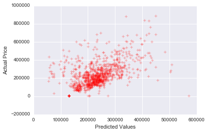

#  Linear Regression Lab

## Introduction

> ***Note:*** _This can be a pair programming activity or done independently._

In this lab we'll be working with [housing data](https://trello-attachments.s3.amazonaws.com/5679b2e91535c674fadb2efe/56b39dbfc8bbe91b11d49e9f/bb26a8e51e1bb392f94c7d7f045b875c/Sacramentorealestatetransactions.csv) from
Sacramento, CA.

## Exercise

> This should be the most individual activity of the session; pairs or small groups
should be fine. This is time for students to solidify their newly gained knowledge.

Our clients were really happy with our earlier work predicting housing values! Now
they'd like us to apply our linear regression skills with a new dataset of
properties from Sacramento. This time the dataset is a bit different so we'll
need to explore the dataset and fit new models to make predictions of prices.

To get started, download the [starter code](code/starter-code/W3 1.4.ipynb),
load the data into a Pandas dataframe and explore the variables.

#### Requirements

- Load the dataset with pandas
- Plot the data in various ways during exploratory analysis
- Fit multiple linear regression models to the data.
- Produce a plot showing how well the model fits by plotting the true values
versus your best model's predictions

**Bonus:**
- Can you improve your models by fitting separate models to each city? To each
type? Why or why not?
- Find the best model you can using exactly three variables
- Are longitude and latitude useful separately? Try adding each and both to another model and look for mean_squared_error improvement
- Can you find any significant correlations between the non-price variables?
Which ones?

#### Starter code

You can find the [Starter Code here](code/starter-code/W3 1.4.ipynb).

* First familiarize yourself with the individual variables (columns) and their
relationships, making plots as needed with pandas, matplotlib, or seaborn
* The collection of variables is quite a bit different, with some classifying
variables such as "City". To use these variables in linear regression
with scikit-learn you may need to translate them to numbers somehow.
* Along the same lines, you may find it useful to fit different models
to each city, or each housing type. Just make sure that you use enough data
in each case to get a good fit.
* Find the best model you can that predicts price from the other variables

> [Solution code](code/solution-code/W3 1.4-Solutions.ipynb)

#### Deliverable

Make a plot of the true values and predicted values of your best model.

## Additional Resources

