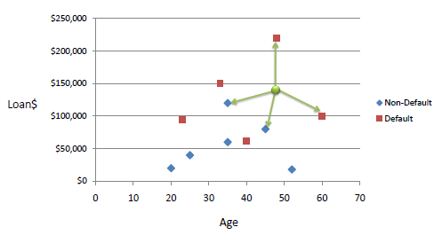
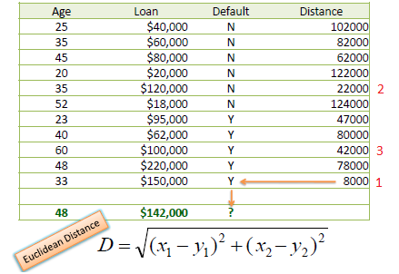

#  Intro to Classification
Week 4 | Lesson 1.1


### LEARNING OBJECTIVES
*After this lesson, you will be able to:*
- Define and give examples of classification
- Explain kNN algorithm
- Build a K-Nearest Neighbors using the scikit-learn library


### STUDENT PRE-WORK
*Before this lesson, you should already be able to:*
- Run Python on your laptop
- Have Basic understanding of the key concepts of Python programming


### INSTRUCTOR PREP
*Before this lesson, instructors will need to:*
- Review Training Package
- Copy and modify the lesson slide deck as required
- Read through datasets and starter/solution code
- Add to the "Additional Resources" section for this lesson


### LESSON GUIDE
| TIMING  | TYPE  | TOPIC  |
|:-:|---|---|
| 5 min  | [Opening](#opening)  | Discuss lesson objectives |
| 10 min  | [Introduction](#introduction)   | Description of Classification  |
| 20 min  | [Demo](#demo)  | How kNN logically works   |
| 25 min  | [Guided Practice](#guided-practice) | Practice kNN and credit default |
| 25 min  | [Independent Practice](#ind-practice)  |  Training set to classify an unknown case  |
| 5 min  | [Conclusion](#conclusion)  | Review / Recap |

---

<a name="opening"></a>
## Opening (5 mins)
- Review current lesson objectives
- Reference general course content or topics (e.g. code or concepts that have been used across multiple lessons)
- Include Hook / Real-world Relevance (why the content from this lesson is useful or important)

> **Check:** Ask students to define, explain, or recall prior concepts or tools.

<a name="introduction"></a>
## Introduction: Topic (10 mins)

Classification is a technique in machine learning of assigning a classification on new instances of data from already observed past data whose classification is known. There are a number of different classification techniques including kNN (k-Nearest Neighbors).

For example, we might build a machine learning model to detect spam emails. By analyzing the content of emails and ‘classify’ them as either spam or legitimate emails. Another example, we might have a number of species of flowers and would like to know what specie of flower is from a dataset of known flowers.

Classification is a machine learning problem for solving a set value given the knowledge we have about that value. Many classification problems boil down to a binary problem. For example, with patient data, one could be working on solving a treatment problem for smokers but first we need to know if their medical history suggests, or is predictive, of whether the patient is a smoker or not.

Many problems don't appear to be binary at first glance, but with a limited set of variables, you can usually boil your model down to a boolean value. For instance, what if you are predicting whether an image pixel will be red or blue? In analyzing the image, we could check whether a pixel "is red" or "is not red." Binary classification is the simplest form of classification, though classification problems can certainly be wrapped around multiple class labels.

#### K-Nearest Neighbors (kNN)

K-Nearest Neighbors (kNN) classification algorithm is one of the simplest to perform and comprehend. It utilizes proximity to known data points with known classifications.

K nearest neighbors stores all available cases and classifies new cases based on a similarity measure KNN has been used in statistical estimation and pattern recognition already in the beginning of 1970’s as a non-parametric technique.

A case is classified by a majority vote of its neighbors, with the case being assigned to the class most common amongst its K nearest neighbors measured by a distance function. If K = 1, then the case is simply assigned to the class of its nearest neighbor.

Choosing the optimal value for K is best done by first inspecting the data. In general, a large K value is more precise as it reduces the overall noise but there is no guarantee. Cross-validation is another way to retrospectively determine a good K value by using an independent dataset to validate the K value. Historically, the optimal K for most datasets has been between 3-10. That produces much better results than 1NN.

<a name="demo"></a>
## Demo: How kNN logically works (20 mins)

Here is some pseudo-code to demonstrate how kNN logically works:

```python
procedure KNN(x)
  begin
    looping through all known data points in training data, find the closest k points to x
    assign f(x) = majority classification among the k closest points
  end
```

Consider the following data concerning credit default. Age and Loan are two numerical variables (predictors) and Default is the target.




We can now use the training set to classify an unknown case (Age=48 and Loan=$142,000) using Euclidean distance. If K=1 then the nearest neighbor is the last case in the training set with Default=Y.




With K=3, there are two Default=Y and one Default=N out of three closest neighbors. The prediction for the unknown case is again Default=Y.

<a name="guided-practice"></a>
## Guided Practice: Demo: Basic kNN Python example code (25 mins)

```python
>>> X = [[0], [1], [2], [3]]
>>> y = [0, 0, 1, 1]
>>> from sklearn.neighbors import KNeighborsClassifier
>>> neigh = KNeighborsClassifier(n_neighbors=3)
>>> neigh.fit(X, y)
KNeighborsClassifier(...)
>>> print(neigh.predict([[1.1]]))
[0]
>>> print(neigh.predict_proba([[0.9]]))
[[ 0.66666667  0.33333333]]

  end
```

<a name="ind-practice"></a>
## Independent Practice: KNN & Breast Cancer Dataset (25 minutes)

Using the Breast Cancer dataset, perform a simple kNN classification on whether a tumor is malignant or benign.

Refer to the [Starter Code](./code/starter-code/week4-1.1-starter.ipynb) to begin.

> **Check: Instructors should review student understanding of model score & interpretation of confusion matrix**

> Here is the [solution code](./code/solution-code/week4-1.1-solutions.ipynb)

<a name="conclusion"></a>
## Conclusion (5 mins)
- What are class labels? What does it mean to classify?
- When to classification ?
- How does the kNN algorithm work?
- How do you define: accuracy, misclassification?

***

### ADDITIONAL RESOURCES

- [How KNN Works](https://saravananthirumuruganathan.wordpress.com/2010/05/17/a-detailed-introduction-to-k-nearest-neighbor-knn-algorithm/)
